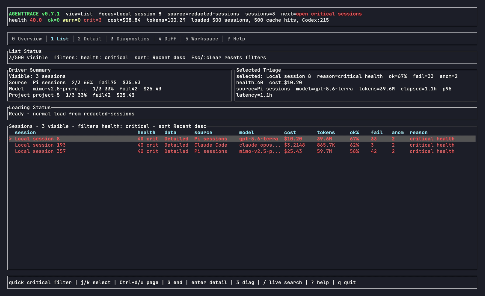
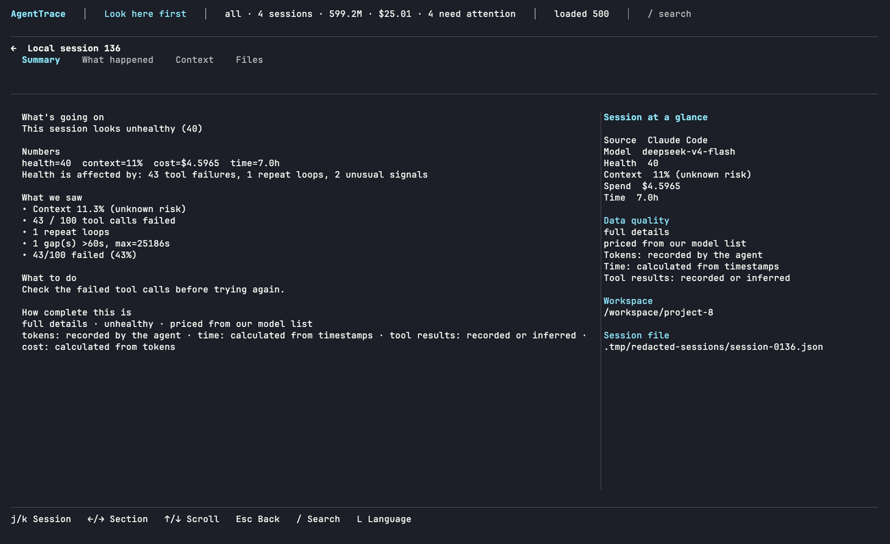

<p align="center">
  
</p>

<h1 align="center">AgentTrace</h1>

<p align="center">
  Local-first TUI and reports for AI coding-agent session history, cost, tokens, time, and slow-run diagnosis.
</p>

<p align="center">
  English | <a href="README.zh-CN.md">简体中文</a>
</p>

<p align="center">
  <a href="https://github.com/luoyuctl/agenttrace/actions/workflows/ci.yml"></a>
  <a href="https://github.com/luoyuctl/agenttrace/releases/latest"></a>
  
  
  <a href="https://github.com/luoyuctl/homebrew-tap"></a>
  <a href="https://www.npmjs.com/package/@zack78/agenttrace"></a>
  <a href="https://github.com/microsoft/winget-pkgs"></a>
</p>

<p align="center">
  
</p>

---

**agenttrace** is a local-first terminal TUI and report generator for AI coding-agent session history. It reads Claude Code, Codex CLI, Gemini CLI, Qwen Code, Cline, Aider, Cursor exports, Hermes Agent, OpenCode, OpenClaw, Pi and its forks (Senpi, Omo) plus agent-dir variants like `~/.pi/agent-cliproxy-only`, Oh My Pi, Kimi CLI, Copilot-style logs, and generic JSON/JSONL traces, then helps with two daily jobs: see what multiple agents spent across cost, tokens, and time; and diagnose why a task ran slowly.

One `agenttrace` binary provides both interfaces: run it without a report action to open the TUI, or pass flags such as `--sessions` and `--overview` for CLI output.

## Why agenttrace?

AI coding agents now behave like small build systems: they call tools, retry, stall, and spend tokens while you only see the final answer.

**agenttrace** reads the logs your agents already write and puts cost-heavy or slow sessions first.

It helps you answer:

- **What did my agents spend?** Compare historical sessions by agent source, model, input/output/cache tokens, estimated cost, and wall-clock time.
- **Why was this task slow?** Catch long gaps, hanging sessions, retry loops, slow tool calls, large parameters, and context pressure.
- **Did a run regress?** Compare against a local baseline when supplied, then inspect incident timelines and conservative tool authority categories in reports.
- **What should I inspect first?** Rank sessions by cost, duration, turns, health, failures, anomalies, model, source, or text search.
- **Can I inspect this privately?** Everything runs locally; prompts, code, and logs do not need to leave your machine.

## Real local run

```bash
agenttrace
```

| Overview | Critical sessions |
|---|---|
|  |  |

| Session detail | Diagnostics |
|---|---|
|  |  |

## Install

Install the latest public release with your package manager. Check the installed
version with `agenttrace --version`.

```bash
# macOS and Linux
brew install luoyuctl/tap/agenttrace

# macOS, Linux, and Windows (requires Node.js 18+)
npm install -g @zack78/agenttrace
```

Windows:

```powershell
winget install --id Luoyuctl.AgentTrace --exact
```

The package names above become available once the corresponding release has
been published. Manual installs remain available without a package manager:

```bash
curl -fsSL https://raw.githubusercontent.com/luoyuctl/agenttrace/master/install.sh | sh
cargo install --git https://github.com/luoyuctl/agenttrace agenttrace
```

```powershell
iwr -useb https://raw.githubusercontent.com/luoyuctl/agenttrace/master/install.ps1 | iex
```

A prebuilt binary that cannot run on this host (for example, one built
against a newer libc) is never installed silently: the installer reports
the loader's error, and `install.sh` falls back to a source build. That
fallback is pinned, never a floating master tip: it builds the release tag
matching the failed artifact (or whatever `AGENTTRACE_SOURCE_REF` names — a
tag or a full commit id; a commit-id pin is fetched directly and verified
against the pin), and records what it built in an install receipt
(`repo`, `ref`, and the exact `commit`) so the fallback install stays
auditable after the fact.

## Quickstart

```bash
agenttrace
```

### CSV statement export (rm-409)

`-f csv` emits RFC 4180 (CRLF rows, `""`-doubled quotes) with one table per
section, marker-comment headers, and a leading apostrophe guard on
formula-looking cells (a name or model id like `=SUM(A1)` or
`=cmd|' /C …'!A0` renders as `'=SUM(A1)` — spreadsheet-safe, byte-stable
across runs, announcements on stderr so stdout stays pure):

```bash
agenttrace --sessions -f csv
agenttrace --overview -f csv
```

Session columns: `session,health,data,source,model,cost,tokens,fail,anomalies,zero_usage_events`.
`zero_usage_events` carries the rm-408 disclosure: transcripts that
REPORT `{input_tokens: 0, output_tokens: 0, …}` are counted as measured
zeros and flagged `zero_usage_reported` in provenance instead of reading
as clean or silently falling back to the text estimate (absent usage
keeps `estimated_from_text`). `--doctor` aggregates the share over the
discovered session-transcript census (SQLite-backed agent databases are
not part of this census yet).
Overview sections (`--overview` required): `# summary`, `# by_model`,
`# by_provider`, `# by_task_type`. `-f csv` outside this composable set
bails loudly (`csv format requires --overview or --sessions`) instead of
silently rendering the text report.

### Shareable usage card (SVG)

`--overview -f svg` renders a single static SVG file — headline cost, sessions,
tool calls, tokens, top models/projects by cost, and a 14-day daily-spend
sparkline, with the same honesty footer as the other overview formats
(window, pricing source, data-confidence). The card is byte-deterministic for
a fixed corpus + range + theme, carries no scripts and no network calls, and
escapes session-derived strings so hostile model or project names render as
text. `--card-theme auto|dark|light` selects the palette (`auto` adapts to the
viewer via `prefers-color-scheme` while degrading gracefully to light).

```shell
agenttrace --overview --range 7d -f svg -o usage-week.svg
agenttrace --overview -f svg --card-theme dark > usage.svg
```

Details and the determinism contract: [docs/guides/usage-card.md](docs/guides/usage-card.md).

### Governance reports

```bash
# Audit raw token components, normalized pricing, and fallback confidence.
# By default this audits every matching session; audited_sessions /
# total_sessions in the JSON (and "(auditing N of M sessions)" in text)
# disclose the coverage. Bound it explicitly with --sample N.
agenttrace --audit --range 30d -f json
# agenttrace --audit --sample 500 -f json

# --range today bounds the report to your local calendar day (sessions
# since your local midnight); 7d/30d are rolling windows, unaffected.

# Optional local model aliases and per-million-token price overrides.
AGENTTRACE_PRICING_FILE=pricing-overrides.json agenttrace --audit -f json
# A requested override file never fails silently: if it is unreadable,
# malformed, carries unknown keys (e.g. a raw LiteLLM snapshot pasted in),
# or holds a negative rate, agenttrace prints a one-line warning to stderr
# naming the path and reason, the pricing label reports
# "user overrides FAILED" (--test-match shows it), and the bundled
# catalog keeps applying. Exit code is unchanged.

# Rank evidence-backed actions by severity and estimated impact.
agenttrace --recommend --range 30d -f json

# Inspect observed MCP invocations. Loaded-server coverage is intentionally
# reported as unavailable unless the source log actually records it.
agenttrace --mcp-governance --range 30d -f json

# Review cross-session context, cache, repeat-read, and read/write trends.
agenttrace --context-trends --range 30d -f json

# Correlate local Git commit timestamps with sessions (heuristic, read-only).
agenttrace --delivery-evidence --range 30d -f json

# Report subscription limit pressure and upstream prompt-cache miss
# causes captured by the statusline hook (see "Statusline capture" below).
agenttrace --statusline-report -f json
```

`pricing-overrides.json` accepts `aliases` plus per-million-token `prices`:

```json
{"aliases":{"provider/raw-model":"my-model"},"prices":{"my-model":{"input":1,"output":2,"cw":0,"cr":0}}}
```

`--overview` now includes scope, parse and pricing confidence, cost audit,
prioritized recommendations, MCP governance, context trends, and delivery
signals in JSON, Markdown, and HTML output. All cost and delivery fields are
explicitly estimates or heuristics; they are not provider billing or proof that
a commit reached `main`.

### Flags go before the session path

`agenttrace` keeps Go-`flag`-compatible argument parsing: option flags are
recognized only **before** the first positional argument. Flags after the
positional are not parsed, so such invocations are rejected with a usage
error naming the dropped arguments:

```bash
agenttrace sessions.jsonl -f json    # rejected: `-f json` follows the path
agenttrace -f json sessions.jsonl    # -f json works
```

`--limit` caps list views only (for example the overview's `recent_sessions`);
it never filters aggregates, audit totals, or recommendations. Governance
reports are unbounded by default — use `--sample N` for an explicitly
disclosed bound.

### `--baseline` and `--compare`

`--baseline <file>` gates an `--overview -f json` run against a previously
saved overview document: thresholds are set with
`--baseline-max-duration-delta-pct` and the token/cost equivalents, and
`--no-baseline-gate` keeps the comparison while skipping the exit-code gate.
`--baseline` requires `--overview -f json`.

`--compare` builds a two-view comparison report over the selected sessions
and never reads a baseline document, so combining `--baseline` with
`--compare` exits 1 with an error naming both flags rather than falling
through to a misleading action error.

### Statusline capture

Subscription limit windows (`5h`/`7d` usage and reset times) and Claude
Code's prompt-cache analytics never appear in session transcripts. To capture
them, register the bundled statusline command once in Claude Code's
`settings.json`:

```json
{
  "statusLine": {
    "type": "command",
    "command": "agenttrace statusline"
  }
}
```

Claude Code invokes the command on every prompt with a single-line JSON
payload on stdin; agenttrace renders the status line and appends the raw
payload to a local journal (`~/.cache/agenttrace/statusline.jsonl`, capped at
10 MiB, oldest lines compacted away; set `AGENTTRACE_SESSION_CACHE_DIR` to
relocate it). Cache files are written owner-only (`0600` on Unix) and
compacted through transient `.tmp.<pid>.<seq>` siblings that the next cache
load reclaims if a crash leaves one behind (see PRIVACY.md). The command
never fails the host — bad or empty input still
exits 0 with a one-line fallback. Review what was captured with
`agenttrace --statusline-report`, the Efficiency panel in the TUI, or
`agenttrace --doctor` ("Statusline capture" line). See
[docs/guides/statusline-capture.md](docs/guides/statusline-capture.md) for the
schema and retention details.

## What you get

| Need | agenttrace gives you |
| --- | --- |
| Historical spend review | Sessions grouped across projects, agents, and models with Today/7d/30d/All ranges |
| Data confidence | Report scope, per-source coverage, parse skips, cache hits, unknown sources/models, pricing fallbacks, and latest observed session |
| Cost audit and action plan | Token component rates, pricing source/status, estimated cost confidence, and prioritized, evidence-backed remediation suggestions |
| Governance trends | Canonical project grouping, observed MCP invocation governance, cross-session context/cache/read-write trends, and read-only Git delivery correlation |
| Honest capability levels | `Detailed`, `Aggregate`, or `Limited` per session so missing event-level evidence is never presented as a complete trace |
| Privacy-safe steps | Tool-step metadata and duration when the source provides call IDs and timestamps; no prompt, response, result, or tool-argument body is stored in steps |
| Slow-task diagnosis | Latency stats, long gaps, hanging sessions, retry loops, slow tools, large params, and context pressure |
| Regression evidence | Local baseline comparison when supplied, incident timelines, and conservative tool authority categories in reports |
| First-session triage | Sort and filter by cost, duration, health, failures, anomalies, model, source, or text search |
| Shareable evidence | JSON, Markdown, and self-contained HTML reports |
| Local-first inspection | No hosted backend required |

## Docs

- Documentation index: [docs/README.md](docs/README.md)
- CI setup: [docs/guides/ci-integration.md](docs/guides/ci-integration.md)
- Governance reports: [docs/guides/governance-reports.md](docs/guides/governance-reports.md)
- Cursor import: [docs/guides/cursor-import.md](docs/guides/cursor-import.md)
- Parser guide: [docs/guides/parser-guide.md](docs/guides/parser-guide.md)
- Maintainer distribution guide: [docs/maintainers/distribution.md](docs/maintainers/distribution.md)

Listed in these open source projects:

- [awesome-mac](https://github.com/jaywcjlove/awesome-mac)
- [antigravity-awesome-skills](https://github.com/sickn33/antigravity-awesome-skills)
- [awesome-claude-skills](https://github.com/BehiSecc/awesome-claude-skills)

## Contributing

Parser PRs are welcome. A good parser contribution usually includes:

- a tiny redacted fixture or synthetic sample
- format detection in `crates/agenttrace-core/src/parser.rs`
- role, timestamp, model, token usage, tool call, and tool error extraction
- tests for successful parsing and malformed input

Run before sending a PR:

```bash
cargo test
cargo build --release -p agenttrace
target/release/agenttrace --doctor
```

See [CONTRIBUTING.md](CONTRIBUTING.md) for the full contribution flow.

## License

[MIT](LICENSE) © 2026 agenttrace contributors
