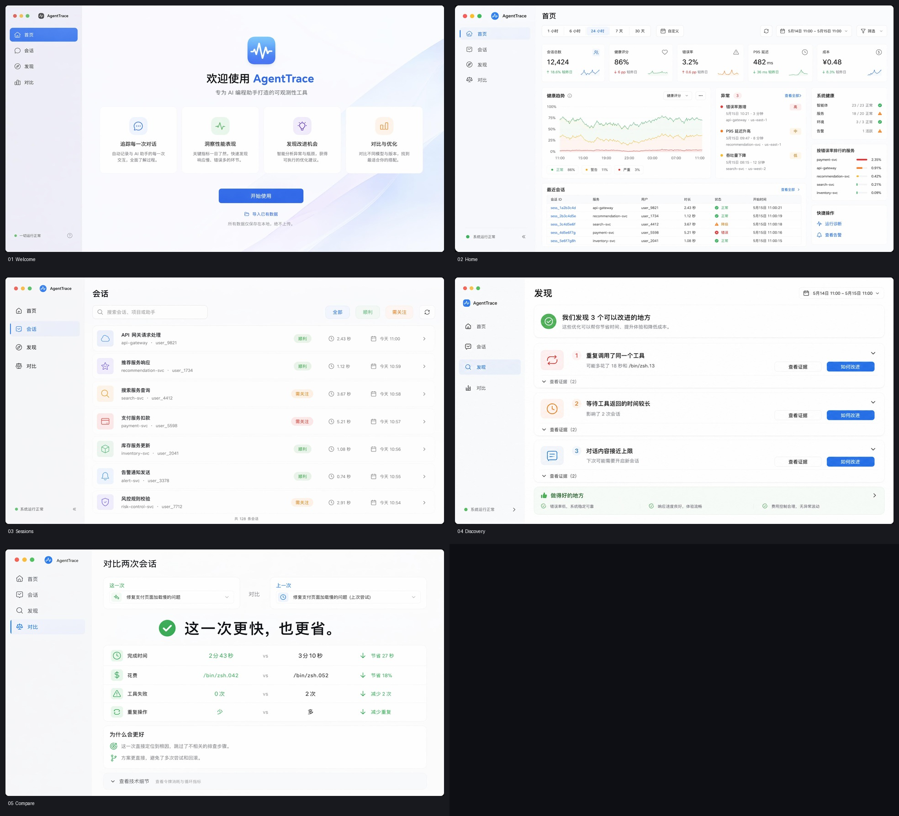

# AgentTrace Desktop Design Reference

## Direction

The selected direction is a calm, consumer-friendly macOS app. It borrows platform interaction patterns without copying a specific Apple application.

Design principles:

- Lead with outcomes, not telemetry.
- Use familiar words before technical terms.
- Show one primary action per surface.
- Reveal evidence progressively.
- Use color as a secondary signal, never the only signal.
- Prefer spacious lists and cards over dense monitoring tables.

## Information Architecture

```text
Home       Recent outcome and items needing attention
Sessions   Task-oriented history and session detail
Discover   Prioritized problems, impact, evidence, recommendation
Compare    Current attempt versus a nearby previous attempt
Settings   Sources, language, appearance, privacy, cache
```

Do not add `Traces`, `Metrics`, `Alerts`, `Dashboards`, `Reports`, `Agents`, or `Environments` as top-level destinations. Those labels came from early visual exploration and are not part of the product scope.

## Language Mapping

| Internal concept | Default user-facing copy | Advanced evidence |
| --- | --- | --- |
| Health score | Completion status / Needs attention | Health score |
| Loop fingerprint | Repeated the same tool call | Fingerprint and count |
| Loop cost | Possible wasted time and cost | Retry and tool-loop cost |
| Tool latency P95 | Waited longer for a tool | P95 and maximum latency |
| Context utilization | Conversation is getting full | Estimated context utilization |
| Stuck pattern | The assistant may be stuck | Pattern type and frequency |
| Tool failure rate | Some tool calls failed | Failed calls / total calls |

Finding structure:

```text
Repeated the same tool call
May have added 18 seconds and $0.13

[View evidence] [How to improve]
```

## Surface Notes

### Welcome

- Explain the product in one sentence.
- Detect supported sources automatically.
- State clearly that analysis happens locally.
- One primary action: start scanning.

### Home

- Lead with a plain-language outcome.
- Show completion, spend, and possible savings.
- Limit attention items to the top three.
- Recent sessions use task titles and relative time.

### Sessions

- Search tasks, projects, and assistant names.
- Default filters: All, Smooth, Needs attention.
- Keep model, tokens, and raw identifiers under `More information`.
- Use a preview inspector before navigating to full detail.

### Discover

- Sort by estimated user impact.
- Each item includes explanation, impact, evidence, and recommendation.
- Include positive feedback so the page is not only an error list.
- Severity labels must include text, not color alone.

### Compare

- State the winner and reason first.
- Compare duration, spend, failures, and repeated work by default.
- Put tokens and diagnostic internals under technical details.
- Default to the selected session and its adjacent previous session.

## Visual References

The images below were generated with TenRouter `gpt-image-2` at `3840x2160`, quality `medium`, on 2026-07-19. They are directional references, not pixel-perfect implementation specifications. Generated text, data, icons, and spacing must be rebuilt with real components and real product data.

### Contact sheet



### Individual surfaces

- [Welcome](assets/desktop-consumer-apple/01-welcome.jpg)
- [Home](assets/desktop-consumer-apple/02-home.jpg)
- [Sessions](assets/desktop-consumer-apple/03-sessions.jpg)
- [Discover](assets/desktop-consumer-apple/04-discovery.jpg)
- [Compare](assets/desktop-consumer-apple/05-compare.jpg)

## Implementation References

- [Apple Human Interface Guidelines](https://developer.apple.com/design/human-interface-guidelines/)
- [Apple layout guidance](https://developer.apple.com/design/human-interface-guidelines/layout)
- [Apple sidebars](https://developer.apple.com/design/human-interface-guidelines/sidebars)
- [Apple toolbars](https://developer.apple.com/design/human-interface-guidelines/toolbars)
- [Apple accessibility](https://developer.apple.com/design/human-interface-guidelines/accessibility)
- [Tauri 2 documentation](https://v2.tauri.app/)
- [Tauri command calling](https://v2.tauri.app/develop/calling-rust/)

Use platform references for behavior and accessibility. Use the concept images for hierarchy and tone. When they conflict, real product data, accessibility, and native platform behavior win.

## Asset Policy

- Keep these source references under `docs/assets/desktop-consumer-apple/`.
- Do not ship the JPGs as application UI assets.
- Recreate icons with the chosen component/icon system.
- Recreate charts with deterministic data visualization components.
- Treat all values and names visible in generated images as placeholders.
